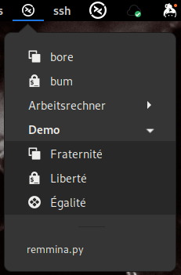

# argos-remmina

An [Argos](https://github.com/p-e-w/argos) plugin that shows Remmina connections
in a Gnome panel menu.

## Overview

You want to have a menu of [Remmina](https://remmina.org) connections in your Gnome panel,
but don't like Remmina's own panel applet for some reason? Then this is for you.

## Why not use Remmina's own panel applet?

1. It doesn't show protocol icons.
2. The applet protocol is going to die. In fact, it is already dead and Gnome doesn't
   support it anymore for a couple of years now, but third party extensions like
   [TopIcons Plus](https://extensions.gnome.org/extension/1031/topicons/) are keeping it
   on life support.
3. I didn't like its bulky icon (included in the screenshot for comparison) in terms of style
   and wasting pixels (my panel is always too narrow for all the stuff I would like to cram
   into it).

## Prerequisites

- [Remmina](https://remmina.org)
- [Argos](https://github.com/p-e-w/argos)

## BitBar compatibility

In theory this plugin should also work with [BitBar](https://github.com/matryer/bitbar),
but I have never heard of anybody using Remmina on MacOS, so this might be completely
irrelevant.

## Feedback

[Issues and Pull requests welcome.](https://github.com/rompe/argos-remmina)

## License

[MIT](LICENSE)
